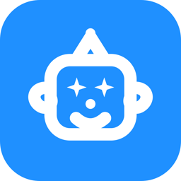
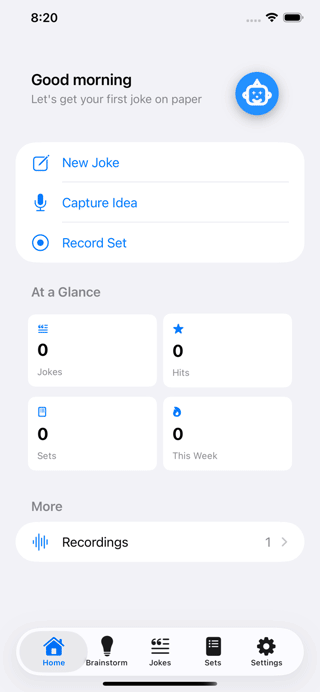
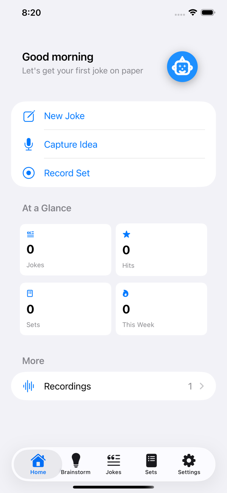
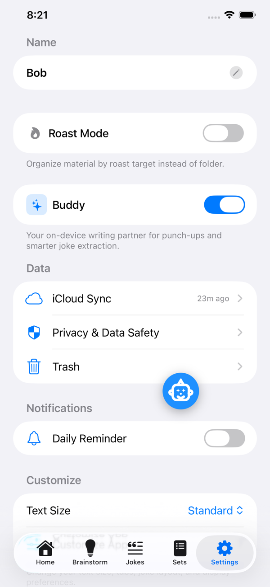
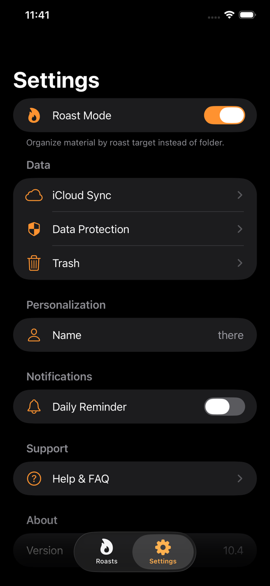
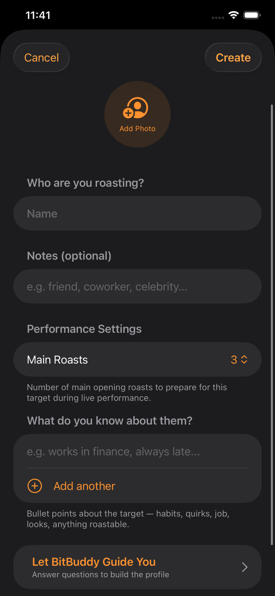
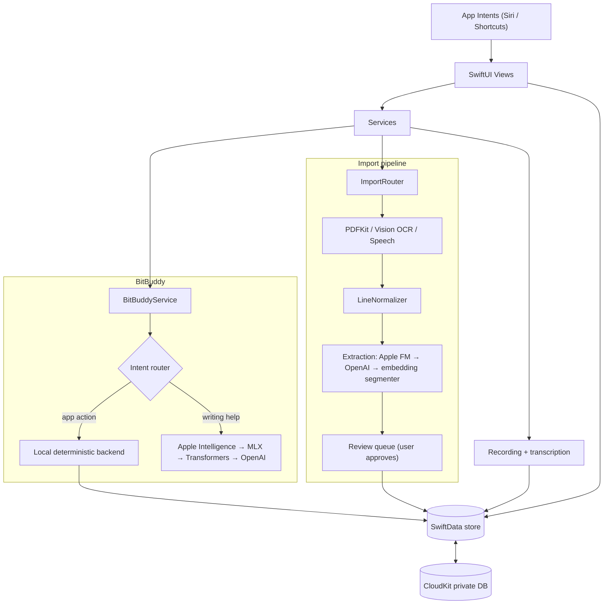

<div align="center">



# BitBinder

**A native iOS notebook for stand-up comedians: write, record, transcribe, import, and build sets from one library.**

[](https://swift.org)
[](https://developer.apple.com/ios/)
[](https://github.com/taylordrew4u2/The-Bit-Binder/actions/workflows/swift-build.yml)
[](https://github.com/taylordrew4u2/The-Bit-Binder/actions/workflows/swiftlint.yml)
[](https://apps.apple.com/us/app/the-bitbinder/id6756085897)

<a href="https://apps.apple.com/us/app/the-bitbinder/id6756085897"></a>

<br><br>



<sub>Walkthrough built from the App Store screenshots (Home, Settings, Roast Mode, new roast target). A slideshow, not a screen recording.</sub>

</div>

---

## Why I built it

Comedy material scatters: a premise in a notes app, the tag in a voice memo, a notebook page saved as a photo, an old set in a PDF, and the version that actually worked only on a recording. BitBinder pulls all of it into one library so a comic can find old bits, compare the written joke with how it landed, and assemble a set without hunting across apps.

## Highlights

- **Assistant that works with or without a model.** BitBuddy classifies each message first. App commands (save a joke, move it to a folder, create a set list) match one of 91 routed intents in `BitBuddyIntentRouter` and run on a deterministic local backend, so they never wait on a download, an API key, or Apple Intelligence. Open-ended writing help goes through an ordered chain: Apple Intelligence, then MLX, then Hugging Face Transformers, then OpenAI, each behind the same `BitBuddyBackend` protocol.
- **Staged, reviewable import.** `ImportPipelineCoordinator` runs validation, file-type routing, extraction (PDFKit, Vision OCR, VisionKit scanning, Speech), line normalization, chunked joke extraction, and mapping. Extraction tries Apple's on-device Foundation Model, then OpenAI if the user added a key, then an on-device embedding segmenter. Nothing is saved until the user approves, rejects, or flags each item for splitting in a review queue, so a bad split never silently becomes a joke.
- **Defensive persistence.** One SwiftData store with CloudKit private-database sync. If CloudKit setup fails, the app reopens the same store file locally rather than switching files. Versioned on-disk backups, a staged restore that runs before the store opens, and soft deletion (`isTrashed` + `deletedDate`) on every major content type protect user writing.
- **Recording that survives navigation.** Recording and transcription live in shared services, with an app-wide indicator that can stop and save from any screen, and sandbox-path repair so recordings still resolve after the container path changes.
- **Platform integration.** Siri and Shortcuts via App Intents, a Background Assets downloader extension for model files, BackgroundTasks scheduling, and a Mac Catalyst target that CI builds as a universal binary.
- **Tested and automated.** Nine standalone Swift regression suites, a 12-test XCTest Siri integration suite, SwiftLint, iOS Simulator and Mac Catalyst builds on every push and pull request, and fastlane lanes for TestFlight and the App Store.

## Features

| Area | What it does |
|---|---|
| **Jokes** | Library with folders, tags, hit and open-mic flags, import metadata, drag and drop, PDF export, and trash recovery |
| **Brainstorm** | Color-coded idea cards with voice notes and one-tap promotion to a full joke |
| **Set lists** | Ordered jokes and roast jokes, estimated runtime, venue and date, and a distraction-free performance mode |
| **Recording** | Record practice or live sets, play back, and transcribe with Apple speech recognition (m4a, wav, mp3, aac, caf, aiff) |
| **Import** | Text, PDFs, photos (OCR), scanned pages, and audio, with a review step and import history |
| **Notebook** | Photo-based source pages with folders and on-device document scanning |
| **Roast mode** | Targets with traits and photos, roast jokes, relatability scoring, and roast sets |
| **BitBuddy** | In-app writing assistant with app actions, a per-writer style profile, and pluggable model backends |
| **Organization** | Auto-organize, duplicate detection, and private on-device search |
| **Sync** | iCloud sync through CloudKit, iCloud key-value preferences, backups, and sync diagnostics |

## Screenshots

<table>
  <tr>
    <td align="center"><br><sub>Home: quick actions and stats</sub></td>
    <td align="center"><br><sub>Settings: BitBuddy, iCloud sync, trash</sub></td>
    <td align="center"><br><sub>Roast Mode theme</sub></td>
    <td align="center"><br><sub>New roast target</sub></td>
  </tr>
</table>

<sub>iPhone screenshots from the <a href="https://apps.apple.com/us/app/the-bitbinder/id6756085897">App Store listing</a>, captured on earlier releases.</sub>

## Architecture



**Design decisions**

- **Route before generating.** Commands that change data go through the intent router and a deterministic backend; only open-ended requests reach an LLM. App actions stay predictable, and the assistant still works on devices with no model and no network.
- **One protocol, many backends.** Every assistant and extraction backend conforms to a shared protocol and is tried in a fixed order, so adding or reordering a provider does not touch UI code.
- **Review before persist.** Imported material is staged and approved by the user. A wrong split is cheap to fix in review and expensive to clean up later.
- **Never switch store files.** Every fallback path opens the same SwiftData file, because a new empty store looks to the user like lost data.
- **Extraction is gated.** `AIJokeExtractionManager` only accepts calls from the import pipeline, so interactive features cannot trigger bulk extraction by accident.

More detail: [docs/ARCHITECTURE.md](docs/ARCHITECTURE.md) and [docs/SYNC_TROUBLESHOOTING.md](docs/SYNC_TROUBLESHOOTING.md).

## Tech stack

| Layer | Technology |
|---|---|
| Language and UI | Swift 5, SwiftUI |
| Persistence and sync | SwiftData (12 `@Model` types), CloudKit private database, iCloud key-value store |
| Audio and text | AVFoundation, Speech, Vision, VisionKit, PDFKit |
| Assistant | Apple Foundation Models, [`mlx-swift-lm`](https://github.com/ml-explore/mlx-swift-lm), [`swift-transformers`](https://github.com/huggingface/swift-transformers), OpenAI API |
| System | App Intents, BackgroundTasks, Background Assets, UserNotifications, Keychain |
| Tooling | Xcode, SwiftLint, GitHub Actions, fastlane |

The OpenAI key is entered in the app and stored in the Keychain (legacy `UserDefaults` values are migrated out). App Transport Security blocks arbitrary loads and lists exceptions only for AI provider domains.

## Getting started

**Requirements:** a current Xcode (CI uses Xcode 26.3), an iOS 18+ simulator or device, and an Apple developer team for the iCloud, App Groups, and background-mode entitlements.

```bash
git clone https://github.com/taylordrew4u2/The-Bit-Binder.git
cd The-Bit-Binder
open thebitbinder.xcodeproj
```

Select the `thebitbinder` scheme, pick an iOS 18+ simulator, device, or **My Mac (Mac Catalyst)**, set your signing team and bundle identifier, and run. Swift packages resolve automatically. No `.env` file is needed. The `bit` scheme builds the background downloader extension on its own.

Release builds need App Store Connect credentials, which are not committed:

```bash
bundle exec fastlane beta      # TestFlight
bundle exec fastlane release   # App Store
```

## Testing

```bash
bash Tests/run-regressions.sh
```

This compiles and runs nine standalone regression suites against the production source files: joke-editor persistence, autosave, list ordering, editable rows, tab navigation, BitBuddy compact layout, text size, action colors, and Siri capture.

The `thebitbinderTests` XCTest target holds `SiriIntegrationTests` (12 tests). Run it from Xcode or with `xcodebuild test -scheme thebitbinder -only-testing:thebitbinderTests/SiriIntegrationTests` on an iOS 18+ simulator. See [Tests/Siri.md](Tests/Siri.md).

[GitHub Actions](.github/workflows) runs the regression suites, an iOS Simulator build, the Siri tests, a universal Mac Catalyst build, and SwiftLint.

## Project structure

```
thebitbinder/
├── Models/       SwiftData models
├── Views/        SwiftUI screens and components
├── Services/     Assistant, import, recording, transcription, sync, data safety
├── CloudKit/     Error classifier and Core Data groundwork
├── AppIntents/   Siri and Shortcuts
└── Utilities/    Design system, logging, editor helpers
bit/              Background Assets downloader extension
thebitbinderTests/ Siri integration tests (XCTest)
Tests/            Standalone regression suites + runner
fastlane/         TestFlight and App Store lanes
site/             Static marketing site
docs/             Architecture, sync troubleshooting, design specs, README media
```

Contribution conventions are in [CONTRIBUTING.md](CONTRIBUTING.md).

---

<p align="center">Built by Taylor Drew · <a href="https://github.com/taylordrew4u2">github.com/taylordrew4u2</a></p>
